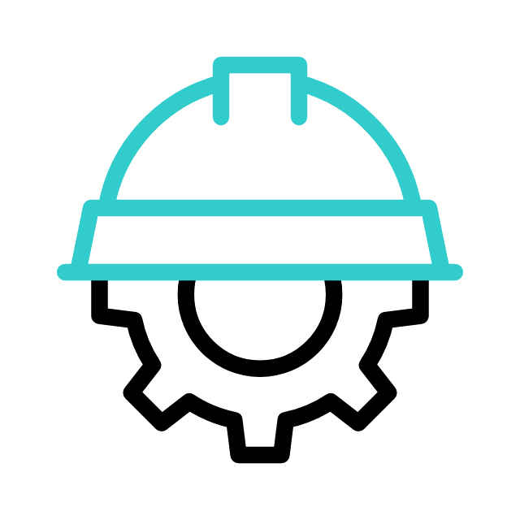

# dotMSG

  
  

    <h1 class="uc-title">Em Construção...</h1>
    
Projeto em desenvolvimento

  

Contribuições e sugestões: abra uma issue ou envie um pull request.

---

**Atribuição**

Ícone animado "Hammer (capacete)" — obtido do Flaticon. Icone por Freepik. Uso gratuito mediante atribuição. Página do recurso: https://www.flaticon.com/free-animated-icon/helmet_10690614 